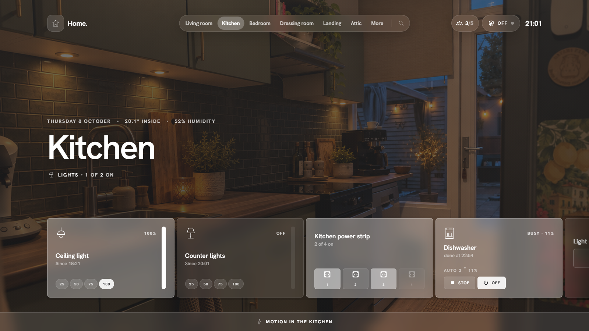

# Cards

Every entity in a room becomes a card. A card shows its icon top left, its state top right, the name and a short line in the middle, and an optional extra line at the bottom.

**Tap and hold.** By default lights and switches **toggle on tap** and open details on **hold**. Everything else opens details on tap. Media, covers and thermostats also have buttons right on the card. You can change all of this per card or per card type: see [Card settings](card-settings.md).

## Lights

A thin vertical bar on the right sets the brightness (drag it; dragging to 0 turns the light off). The bottom line can show:

| bottom | shows |
|---|---|
| auto | brightness steps (25, 50, 75, 100) when the light is dimmable |
| steps | always the brightness steps |
| colors | colour dots; lights with only colour temperature get warm, neutral and cool |
| today | 24 hourly bars of when the light was on today |
| none | nothing |

## Switches and smart plugs

A switch toggles on tap. A switch whose device also reports **power** becomes a plug card: live watts big, kWh used today, and a three-hour sparkline. The bottom line can also be a **timer** (switch off after 15, 30, 60 … minutes), the **cost** today (set your price under *Settings → Energy*), or hourly **bars**. You can link a power sensor by hand when it lives on another device.

Power strips with several outlets get one card with a button per outlet.

## Appliances

Washing machines, dishwashers and dryers are recognised in two ways:

- a device that reports its own status (Home Connect, Miele, LG ThinQ …): the card shows the programme, progress, finish time and door, with a **Stop** button;
- a smart plug with a power meter: *busy* above a threshold (5 W by default, adjustable per card), *done* when it drops, *standby* otherwise.

## Media

Artwork as the card background, title and artist, and previous / play-pause / next on the card. Players without artwork (TV apps) get the app's colours. When the same TV appears through several integrations (Android TV, Cast, Bravia), they are merged into one card.

## Climate

The target temperature big, current temperature below it, and a rail on the right to drag the target up and down. HVAC modes and presets sit in a row at the bottom. The popup lists every room's temperature.

## Covers, fans, locks, vacuums, humidifiers

- **Covers**: up and down buttons; covers with a position get the vertical bar.
- **Fans**: vertical bar for speed, presets and oscillation in the popup.
- **Locks**: tap to lock or unlock.
- **Vacuums**: start / pause and return to dock.
- **Humidifiers**: target up and down, mode in the popup.

## Sensors

Doors, windows, motion, smoke, leak and other binary sensors show their state and how long it has been that way ("Closed · since 08:51"). Their bottom line can show **today**: when they were active, as bars. Battery-powered sensors can show the battery level in the corner.

## Cameras

A live snapshot that refreshes every few seconds without flicker; tap for the stream and the motion events of the last 24 hours.

## Home view cards

- **Attention**: unavailable devices, low batteries, updates and notifications.
- **Weather**: condition, temperature and a rain heads-up.
- **Waste**: the next pickups (works with the Afvalbeheer and Afvalwijzer integrations and any sensor with a date).
- **Agenda**: the next events from the calendars you choose.
- **Scenes**: your favourite scenes as buttons.
- **Energy**: power now and today's use.

## Groups

**Settings → Groups** combines several lights, switches or plugs into one card, placed in a room or on the home view. Style *tiles* shows a master switch with a chip per member; *list* shows the members as rows.

## Light scenes

Every room with lights gets a **Light scenes** card. Save the current state of the room's lights (on/off, brightness, colour) as a preset and recall it with one tap.

## Template cards

**Settings → Template cards** adds cards whose text and label are **Jinja templates**, rendered live by Home Assistant. Place them on the home view or in a room and give them a tap action: details, toggle, a service call or navigation.

!!! note
    Templates are rendered by Home Assistant's template websocket, which needs an administrator account.
