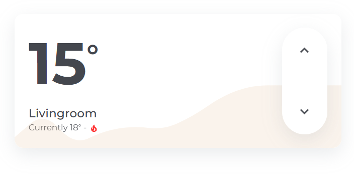

# Climate Card

With the `hc_climate_card` you can control your climate. The big number shows the set temperature and you can see the current temperature on the bottom. The buttons provide to change the set temperature.



## Usage

```yaml
  - type: custom:button-card
    template: hc_climate_card
    entity: <climate entity>
```
## Variables

| Variable | Default | Required | Description|
|----------|---------|----------|------------|
| show_window_state | false | No | If true, the window state will be shown. |
| window_open_boolean |  | No | The entity that shows if the window is open. |
| show_mode_state | true | No | If true, the mode state will be shown as a icon next to the current temperature. |
| show_graph | false | No | If true, a graph will be shown as background. |
| graph_entity |  | No | The entity that will be shown in the graph. |
| graph_color | var(--color-red) | No | The color will be used for the graph. |

## Contribution
- [ptC7H12](https://github.com/ptC7H12)