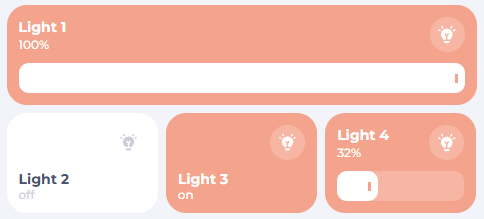

# Light Card
The `hc_light_card` is used to turn on and off a light. You have the option to show or hide the bightness slider.




## Usage

```yaml
  - type: custom:button-card
    template: hc_light_card
    entity: <your light entity>]
    name: MyLight
    variables:
        enable_slider: True
```
**Remember to take care of indentation**
## Variable / entry

| Variable | Default | Required | Example|
|:----------|:---------|:----------|:------------|
| <span class="entry-type-ha"></span> entity | | **Yes** | light.livingroom |
| <span class="entry-type-ha"></span> name | friendly name | No | Livingroom Light |
| <span class="entry-type-hacasa"></span> enable_slider | False | No | Show or hide the brightness slider|
| <span class="entry-type-hacasa"></span> card_color | var(--color-orange) | No | The color of the card |

## More info
More explanation about how some things are working.

### Brightness and slider
The slider and brightness will only show if the light entity emmits a brightness attribute. If not, then the slider won't be visible, even if you have `enable_slider: true` and the brightness percentage will just be the state of the light (on/off).