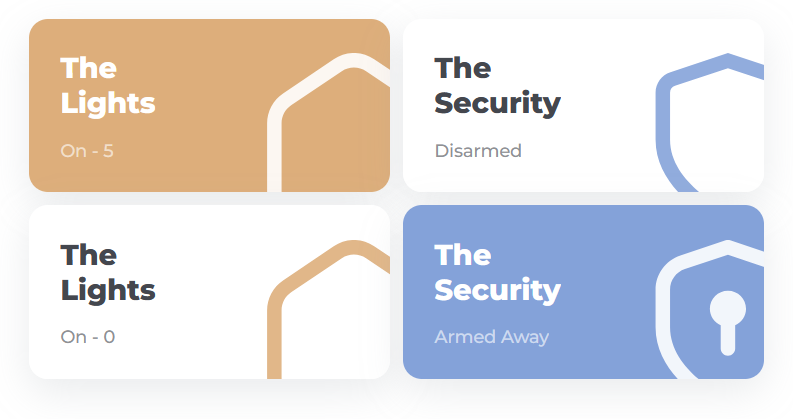

# Navigation Card

**This card is not fully developed and has a more advanced configuration for determining the color based on the state. Any questions or issues can be asked in the [Discord server](https://discord.gg/7yt64Tf) or at [Github](https://discord.gg/7yt64Tf).**

The `hc_navigation_card` can be used to navigate to certain pages in your dashboard. Although, because HaCasa is so versitile, you can also use this card as a action card without navigation or give it another hold action.



This card is also used for the security card. Use the tabs beneath to switch between the 2 different uses.

## Usage Navigation Card

```yaml
  - type: custom:button-card
    template: hc_navigation_card
    name: <title of the card>
    entity: <entity for label>
    icon: <icon>
    variables: 
      label_prefix: 'On - ' # Prefix can by anything but the state of the entity will be added after it.
      color: var(--color-orange) # color of the card when the state underneath is met (in this case, higher then 0)
    state:
      - value: 0 # Can also be 'on'
        operator: '>' # if value above is 'on', remove this line
        styles:
          card:
            - background: "[[[ return variables.hc_color ]]]" # Let this be
          name:
            - color: white
          label:
            - color: white
          icon:
            - color: white
      - value: 0 # Can also be 'off'
        styles:
            icon:
              - color: <desired icon color> # color of the icon when the state is met (in this case, just 0)
    tap_action:
      action: navigate
      navigation_path: <navigation path>
```
## Usage Security Navigation Card

```yaml
  - type: custom:button-card
    template: hc_navigation_card_security
    name: <title of the card>
    entity: <security entity>
    variables: 
      color: var(--color-blue) # color of the card when the alarm is not off
    tap_action:
      action: navigate
      navigation_path: <navigation path>
```


## Variables

| Variable | Default | Required | Description|
|----------|---------|----------|------------|
| label_prefix | 'On - ' | No | Prefix can by anything but the state of the entity will be added after it. |
| color | var(--color-orange) | No | The color of the card when the state is on |
| icon_color | var(--text) | No | The color of the icon when the state is off |
