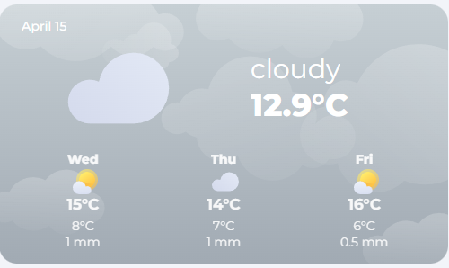

# Weather Card

The weather card is a dynamic card that changes based on conditions. There is a different color, image and icons for the different weather conditions.




## Usage

### Custom Sensor needed
Before you can use this card, you need to have a custom sensor that gets the forecast data. You can create a custom sensor inside your `configuration.yaml` or create a `templates.yaml` file in the root of Home Assistant and add `template: !include templates.yaml` to your `configuration.yaml`. Then, add this code underneath, save the file and reload your configuration.


```yaml
- trigger:
    - trigger: time_pattern
      hours: /1
    - trigger: event
      event_type: event_template_reloaded
  action:
    - action: weather.get_forecasts
      target:
        entity_id:
          - weather.home
      data:
        type: daily
      response_variable: dailyforecast
  sensor:

    - name: Weather Entity Forecast
      unique_id: weather_entity_forecast
      state: "{{ states('weather.home') }}"
      icon: mdi:hours-24
      attributes:
        condition: "{{ states('weather.home') }}"
        cloud_coverage: "{{ state_attr('weather.home','cloud_coverage') }}"
        temperature: "{{ state_attr('weather.home','temperature')  }}"
        wind_speed: "{{ state_attr('weather.home','wind_speed')  }}"
        wind_gust: "{{ state_attr('weather.home','wind_gust_speed')  }}"
        dew_point:  "{{ state_attr('weather.home','dew_point') }}"
        wind_bearing:  "{{ state_attr('weather.home','wind_bearing') }}"

        datetime: "{{ dailyforecast['weather.home'].forecast[0].datetime }}"
        forecast: "{{ dailyforecast['weather.home'].forecast }}"
```


Now, you should have a new sensor called `sensor.weather_entity_forecast` which you can use as entity in this card.

**Note:** If you want to use another weather provider like Buienradar or Accuweather, just replace `weather.home` with your desired intergration.

### View code

```yaml
      - type: custom:button-card
        template: hc_weather_card
        entity: sensor.weather_entity_forecast
        variable:
          show_forecast: false
```

## Variables

| Variable | Default | Required | Description|
|----------|---------|----------|------------|
| label_left | returns date | No | text in left top corner |
| label_right |  | No | text in right top corner |
| show_forecast | true | No | shows or hides the forecast |

## Contribution
- [Coasting24](https://github.com/Clooos) did most of the work