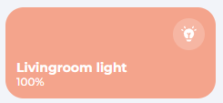
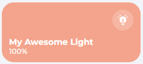
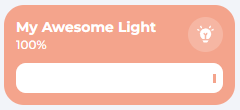

# Usage
We made HaCasa easy to use but you need to know a few basics. 
{: .fs-6 .fw-300 }

## Variables and entries
All of the cards are using the default entries from Home Assistant and variables set in the template cards from HaCasa. Almost most of the cards require at least one of them and sometimes both.

For example, the light cards requires you to add a `light entity` which you can enter through the `entity:` entry.

```yaml
  - type: custom:button-card
    template: hc_light_card
    entity: light.livingroom
```


It is also possible to change the name of the light by giving the `name:` entry, like so:

```yaml
  - type: custom:button-card
    template: hc_light_card
    entity: light.livingroom
    name: My Awesome Light
```


With variables, you can change certain aspects in the card, eg. enabling the slider

```yaml
  - type: custom:button-card
    template: hc_light_card
    entity: light.livingroom
    name: My Awesome Light
    variables:
      enable_slider: true
```


Every card you will see on this documentation page have all the needed and optional variables described. Based on round color, you can see if its a Home Assistant default Entry or a variable from HaCasa.

**Legend:** <span class="entry-type-ha"></span> Home Assistant Entry - <span class="entry-type-hacasa"></span> HaCasa variable