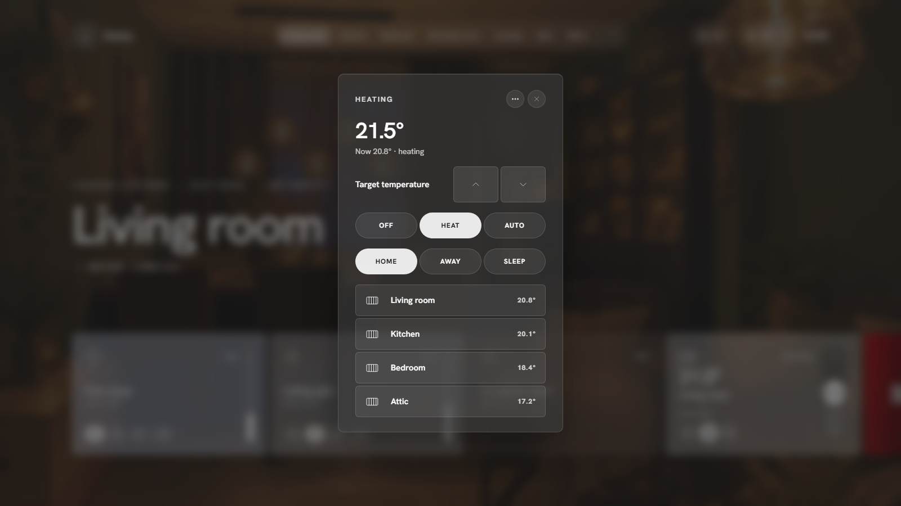

# Popups and extras

## Popups

Every card opens a popup with the details: brightness, colour and colour temperature for lights, transport and volume for media, modes and presets for climate, position for covers, and the history of the last 24 hours for sensors.

The **⋯** button next to close offers **Card settings** (see [Card settings](card-settings.md)) and **Open in Home Assistant**, Home Assistant's own dialog for the entity.

## Search

The magnifier in the navigation searches rooms, pages and devices. **Enter** opens the first hit, **Escape** clears.

## Presence

The people pill shows how many people are home; tap for the list with their profile pictures.

## Alarm

The shield pill shows the alarm state. Tap to arm or disarm. When the alarm panel uses a code, a keypad appears.

## Doorbell and camera popup

Under **Settings → Motion & doorbell** pick trigger sensors (a binary sensor or an event entity) and a camera. When one fires, the camera stream pops up (and wakes the idle screen), and closes again after the time you set. The same tab chooses which motion sensors feed the motion bar.

## Modes

**Settings → Modes** links modes such as *Guest* or *Vacation* to an `input_boolean` or switch. Toggle them from the More menu; an active mode shows in the notification line. Your automations in Home Assistant do the actual work.

## Idle screen

**Settings → General → Idle screen**: after a number of minutes without touch, the panel dims to the clock, date, weather and a status line. A touch wakes it. Made for wall tablets.

## Notifications

Home Assistant's persistent notifications appear in **Attention** and in the notification line. Tap one in the Attention popup to dismiss it.

## Connection

When the connection to Home Assistant drops, a red pill at the top says so until it is back.

## Language

English and Dutch. **Settings → General → Language**: automatic (follows your Home Assistant profile), English or Nederlands. Other Home Assistant languages fall back to English.
