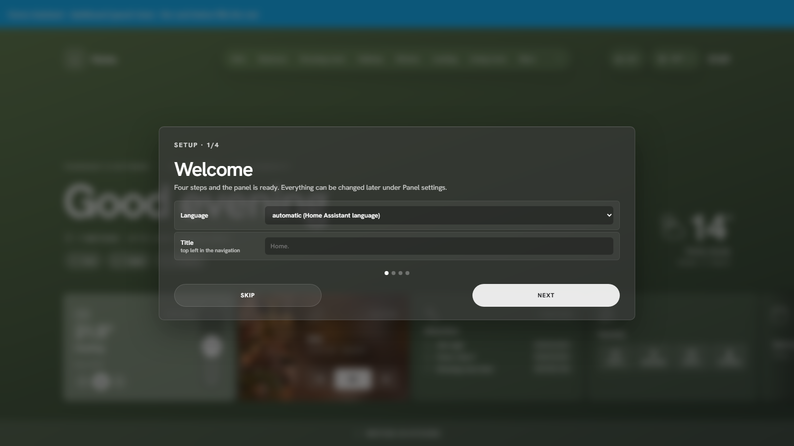

# First run

The first time a user opens HaCasa Nova, a four-step setup appears. Every step can be skipped, and everything can be changed later under **More → Panel settings**.

1. **Welcome**: language (automatic follows your Home Assistant profile, or pick English or Nederlands) and the title shown top left.
2. **Rooms**: tick the areas that should become rooms. Their order is the order of the navigation; you can change it later under *Rooms*.
3. **Home page**: the weather entity, thermostat, alarm panel, and the power and energy sensors for the home view. Left empty, the panel picks the first of each it finds.
4. **Photos**: where room photos live. See [Room photos](photos.md).

## How rooms are built

A room is a Home Assistant **area**. Every entity assigned to that area, directly or through its device, is placed on the room page as a card. To move a lamp to another room, change its area in Home Assistant.

Entities with the *diagnostic* or *config* category are left out (except batteries, which feed the Attention list). Room temperature and humidity come from the area's temperature and humidity sensors.

If you use **floors** in Home Assistant, the navigation can group rooms per floor: **Settings → General → Navigation → per floor**.

## Settings are per user

Settings are stored with Home Assistant's frontend user data, per user. They follow you to every phone, tablet and browser where you log in, and survive updates of the panel. Each member of the household can arrange the panel their own way.

To copy a setup to another user or another Home Assistant, use **Settings → General → Settings file → Export**, then **Import** on the other side.

## Running it again

**Settings → General → Setup wizard** runs the wizard again. **Reset everything** (top of the settings page) clears all settings of the current user.
