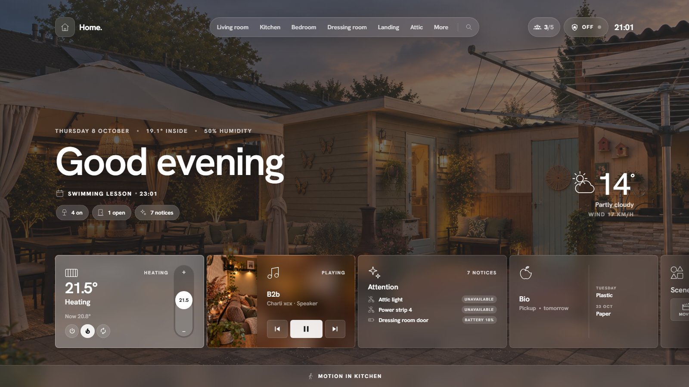
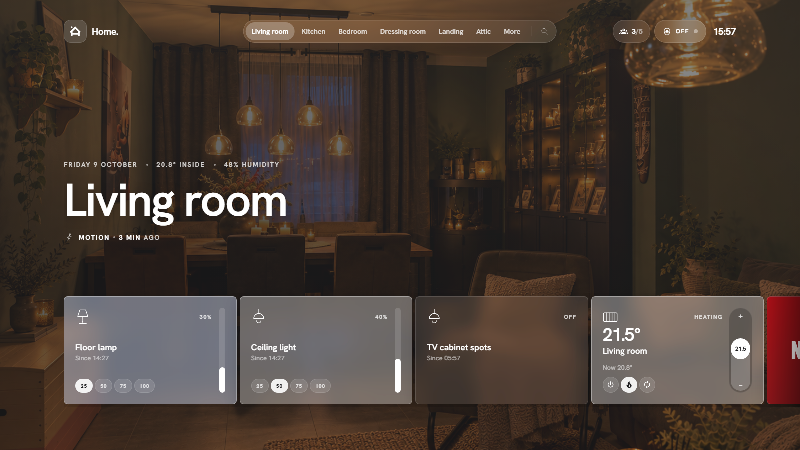
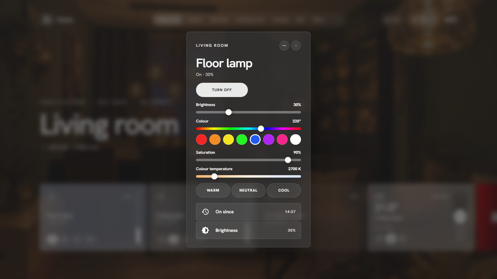
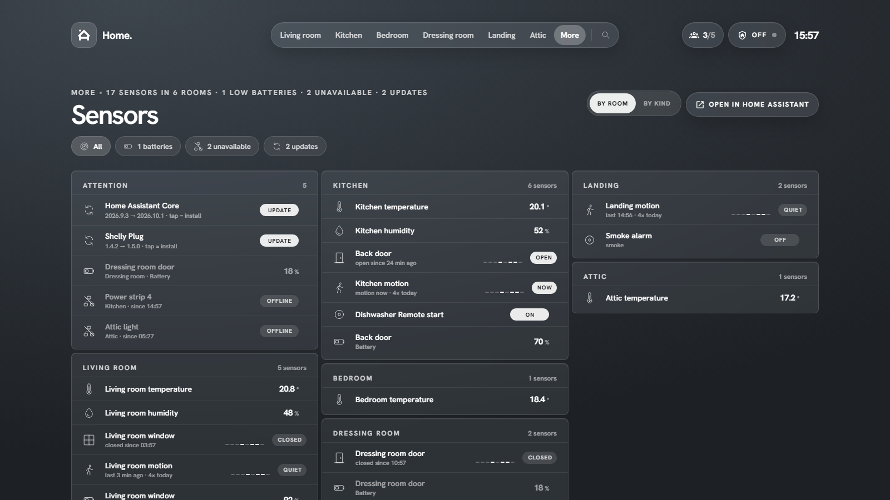
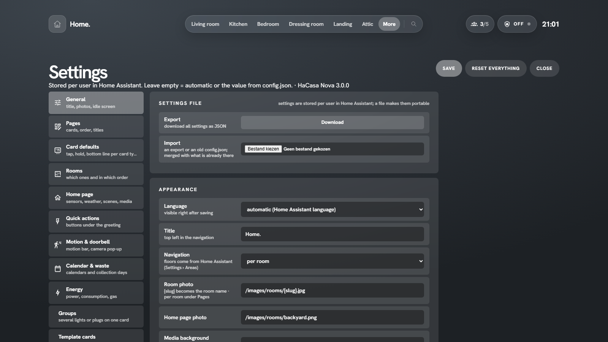
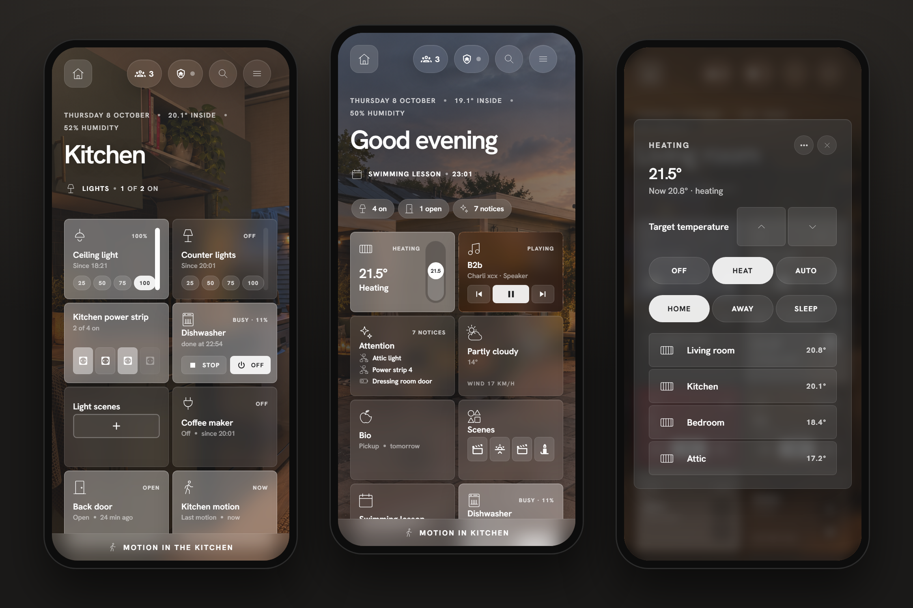

---
hide:
  - navigation
---

# HaCasa Nova

The HaCasa reboot. A room-first Home Assistant panel, built on the <a href="https://github.com/iamtherufus/Homio">Homio</a> design by iamtherufus.

[Install it](installation.md){ .md-button .md-button--primary } [View on GitHub](https://github.com/damianeickhoff/HaCasa){ .md-button }

!!! danger "Work in progress"
    HaCasa Nova is a work in progress and needs testing. This first release has only been run on a handful of homes, so expect rough edges: things may break or change between versions. Try it next to your current dashboard rather than replacing it, and please [report what you run into](https://github.com/damianeickhoff/HaCasa/issues/new/choose). Known issues are tracked in [#158](https://github.com/damianeickhoff/HaCasa/issues/158).

## What it is

HaCasa Nova is a full-screen panel for [Home Assistant](https://www.home-assistant.io/). It turns your **areas** into rooms, each with its own photo and a strip of cards, and puts a calm home view in front of them: greeting, weather, what needs attention, and the things you use every day.

It is a single JavaScript file. There is no YAML dashboard to maintain and nothing else to install: no button-card, no card-mod, no layout-card. Add a device to an area in Home Assistant and it shows up in the right room by itself.

## Why "Nova"?

The original **HaCasa** was a button-card dashboard that grew to almost 500 stars on GitHub before it was archived in 2025. *Casa nova* means "new house", and a nova is an old star that suddenly shines again. That is what this is: HaCasa, rebuilt from scratch on the beautiful [Homio](https://github.com/iamtherufus/Homio) design by **iamtherufus**.

## Highlights

<figure markdown>

<figcaption>Rooms come straight from your Home Assistant areas.</figcaption>
</figure>

<figure markdown>

<figcaption>Every card opens a detailed popup.</figcaption>
</figure>

<figure markdown>

<figcaption>Sensors, energy, automations, cameras and system pages are built in.</figcaption>
</figure>

<figure markdown>

<figcaption>Everything is configured inside the panel and stored per user.</figcaption>
</figure>

## Where next

- **[Installation](installation.md)**: HACS, then a sidebar panel or a dashboard card.
- **[First run](first-run.md)**: the four-step setup.
- **[Cards](cards.md)**: what every card does and how to change it.
- **[Settings](settings.md)**: a tour of the settings page.
