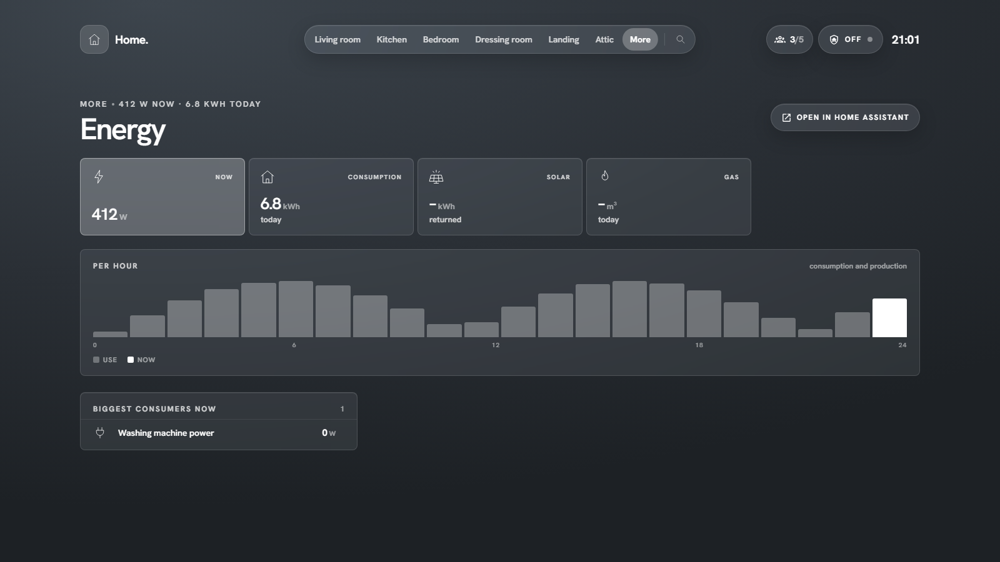

# Pages

Besides the rooms, **More** in the navigation opens a set of built-in pages. Pages that have a Home Assistant counterpart have an **Open in Home Assistant** button top right.

## Sensors

**Attention** comes first: updates (tap to install), low batteries, unreachable devices. Then a block per room, or per kind (doors, windows, motion, climate …) with the toggle top right. Filter pills narrow it down to batteries, unavailable or updates. Binary sensors show a small trend of today.

The Sensors page also estimates how many days a battery has left, from 30 days of statistics.

## Energy

Power now, consumption and solar return today, gas, today per hour from the recorder, and the biggest consumers right now. Choose the sensors under **Settings → Energy**.

!!! tip
    The per-hour chart needs long-term statistics on the energy sensor (any sensor with a `state_class`).

## Automations

Every automation with a toggle, grouped by **with errors**, **on** and **off**, plus which one ran last and how many ran today. Tap toggles, hold opens Home Assistant's dialog.

## Cameras

All cameras with a live snapshot; tap for the stream.

## System

Home Assistant version and uptime, host info from the Supervisor (when available), entity counts, pending updates, and the **System Monitor** sensors for processor, memory, disk and network (download and upload as sparklines of the last hour).

!!! note
    Host info comes from the Supervisor and needs an administrator account on Home Assistant OS or Supervised.

## Your own links

**Settings → More menu** adds your own entries (label, icon, path) next to the built-in pages, for example to another dashboard.
